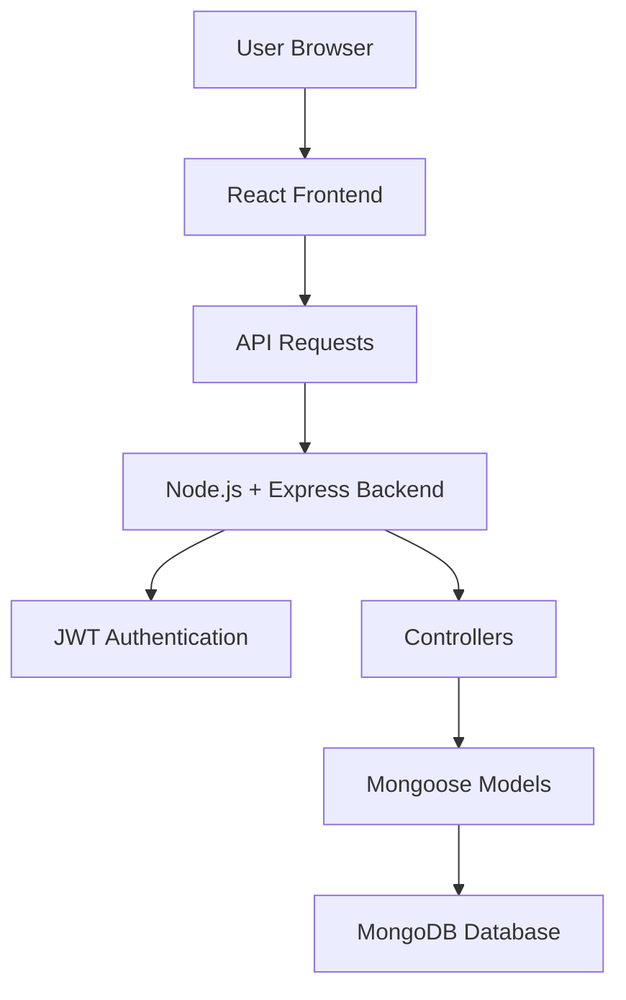
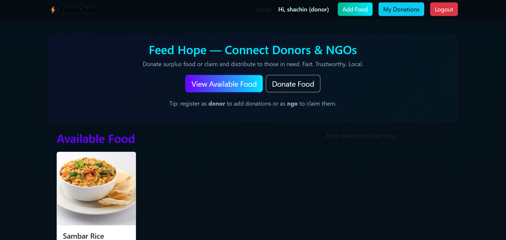
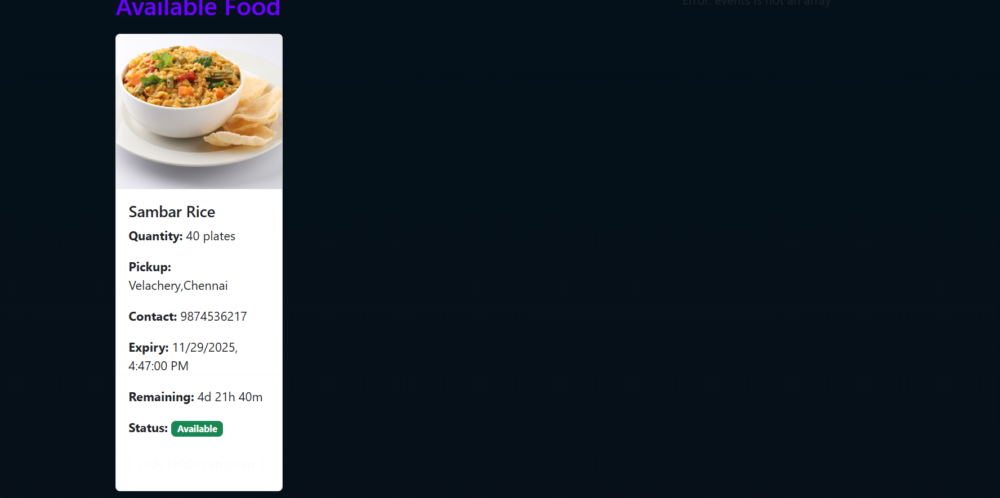
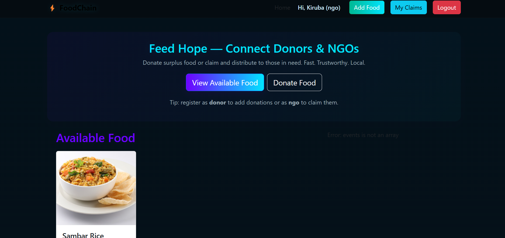
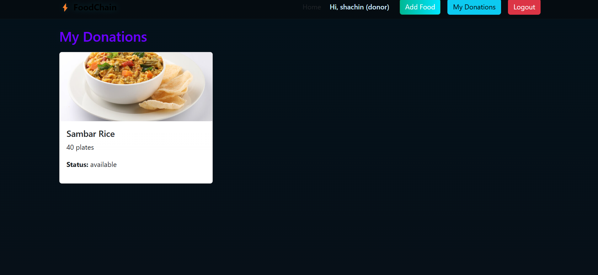
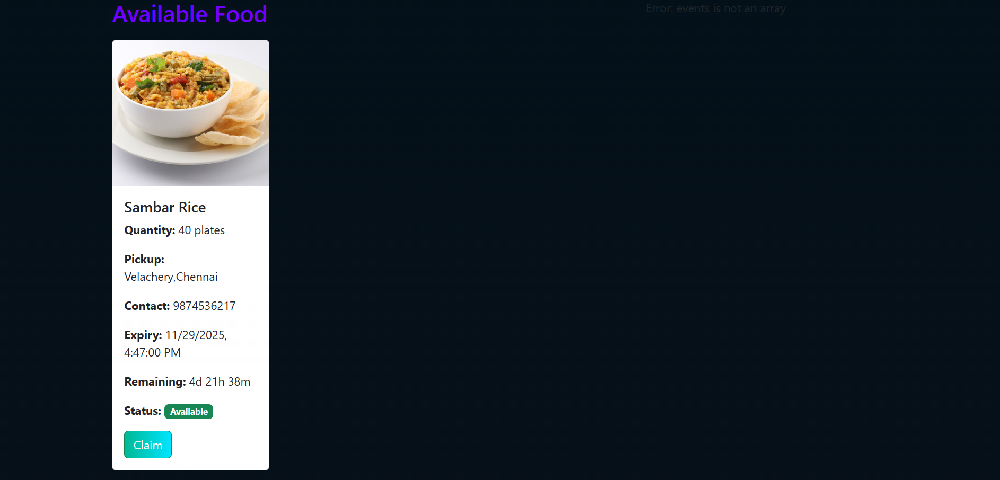

# 🍱 Food Donation & Distribution System

## 🚀 Overview
Food waste is a critical global issue caused by the imbalance between surplus food and people in need.

This project presents a **full-stack web-based Food Donation and Distribution System** that connects donors with recipients in real time. It enables efficient food sharing, reduces waste, and promotes community welfare through a scalable digital solution.

---

## 🎯 Key Features
- 🧾 Secure Authentication (JWT-based login/signup)
- 🍲 Donor Module:
  - Upload surplus food details (image, quantity, expiry time, location)
  - Manage donations
- 🙋 Recipient Module:
  - Browse available food
  - Claim food in real time
  - Track claims
- 📡 Real-time updates using Socket.io
- ⏳ Automatic food expiry handling using Cron Jobs
- 🖼️ Image upload support using Multer
- 📊 Activity tracking system

---

## 🛠️ Tech Stack

### 💻 Frontend
- React.js  
- HTML5  
- CSS3  
- Bootstrap  

### ⚙️ Backend
- Node.js  
- Express.js  

### 🗄️ Database
- MongoDB  
- Mongoose  

### 🔐 Security
- JSON Web Token (JWT)

### 🔄 Real-Time & Automation
- Socket.io  
- Node-Cron  

### 🧰 Tools
- VS Code  
- Postman  
- Git & GitHub  
- npm  

---

## 🏗️ System Architecture



---

## 📸 Outputs & Screenshots

### 🖥️ Application Interface


---

### 🍲 Available Food Listing


---

### 📋 Food Details View


---

### 📦 Donation Food Section


---

### 📦 Claimed Food Section


---

## ⚙️ Installation & Setup

```bash
git clone https://github.com/your-username/food-donation-system.git
cd food-donation-system

# Backend setup
cd backend
npm install
npm start

# Frontend setup
cd ../frontend
npm install
npm start
